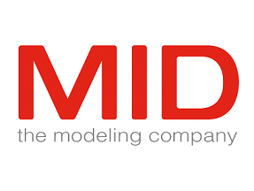

# MID GmbH

[MID GmbH](https://www.mid.de/en) is a German ISV and one of the leading providers of modeling solutions. They have a catalog of products that can help companies from a wide range of sectors, from Business Process Management to Agile Consulting.

One of their lead software is called Innovator Enterprise Modeling Suite, a business tool for modeling and analyzing information from all domains and bringing your data together efficiently. It is currently used by more than 90 customers all around the world with over 16,000 individual users. The user front-end is a complex WPF application based on .NET Framework 4.5, with the particular requirement of being modular: 3rd party developers can develop and integrate plugins to enhance and extend the base application. Together with the server in the backend which hosts data repositories and all semantic configuration, it allows users to collaborate freely across all their models.

Their customers are mostly mid-sized to large companies which all have dedicated client management  in place. MID GmbH provides a MSI installer which could be managed in a basic way using command parameters for different installation scenarios. Due to the complexity of the configuration and the extensibility of the application, this approach has presented several challenges over the years:
1. Each release of the application requires multiple efforts from different teams: development (also 3rd party), client and server deployment and support. This has an impact on the complexity and cost of each update.
1. Since there’s a significant delay between the release of a new version and its deployment to each customer, the agility of the development team is severely impacted.
1. The slow release cycle reduces innovation opportunities for the company and the development team.

With the introduction of MSIX and .NET Core, MID has been able to address these challenges by:
1. Reducing the cost associated with each release. Thanks to MSIX, they are able to tailor an installation to the specific needs of the customer, significantly reducing the support and deployment efforts.
1. Improving the agility of customers, who are now able to deploy new versions of the desktop application as quickly as an update to the server and in a more reliable way.
1. Improving the agility of the development team, which is now able to release new features to customers quicker and adopt the latest and greatest technologies for Windows development.

With MSIX, MID GmbH has been able to simplify an overly complex deployment pipeline. Every new or updated version of the application had to be tested each  time by the customer in order to maintain security and availability of the client computers. Quite often, the customer has outsourced desktop client management to 3rd party companies, which mostly adds even more complexity and additional SLAs.

Jörg Hänfling, Product Manager of Innovator Enterprise Modeling Suite, shared that *“from our perspective as an ISV, we see that many clients only migrate to the latest version every one or two years, which is obviously not what we would want for the investment in our product.”*  MID GmbH heavily invests in innovation, by continuously improving the suite and adding  new features. The inability to quickly and easily deliver new value to their customers heavily affects the outcome of these investments.

Jörg continues *“With the adoption of MSIX, we can drastically simplify the deployment process for our customers. Instead of having different ways of deploying the software itself, the registry settings, more plugin DLLs and additional resources like customer specific icon packs to the clients, there is now only one way to deliver everything. Having the possibility to extend an application with modification packages makes it very easy to tailor an installation to the specific needs for a customer. After you package and test your individual deployment, it is guaranteed to perform in the same way on all the other clients in the enterprise, without the need of any further manipulation . This eliminates almost any margin for error in this regard, whether technical or human, and reduces costs on both the customer’s side and ours.”* 

Additionally, the MSIX adoption helped MID GmbH software get one step closer to the customer in terms of DevOps. They can now offer each of their customers an individual, very specific build of their software, and they can put all the plugins and resources the customer uses into one package that they build with Azure DevOps. The customer support team only needs to hand over that package to the customer and they can install it directly on their clients without any further repackaging or manipulation.  This approach furtherly decreases the costs associated of supporting customers during the deployment phase of the update and enables the development team to build and evaluate new features in a more secure and controlled way.

Also, migrating their solution to .NET Core played a role in improving the deployment agility of their suite. As Jörg shared *“One great advantage of .NET Core is the ability to package the runtime along with the application. Especially in a deployment scenario like the one mentioned above, any dependency less is a good dependency. We also want to be able to benefit from future performance improvements of the .NET Core platform. Our developers are happy to be able to use the most recent C# functionality  as soon as they see fit and not as late as the slowest customer determines”.* 

MID GmbH has now fully migrated to .NET Core and will continue to push the application with .NET 5.0, with the goal of being able to take advantage of all the current and future innovations in the Windows development space. 

