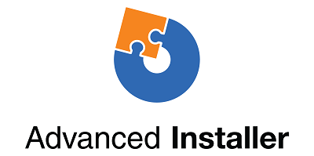
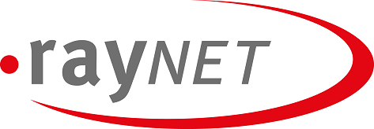

# Package a desktop app using third-party installers

Below is a list of popular third-party products and installers that support the ability to package a desktop application. You can use them to generate MSI installers or app packages with only a few clicks. While we don't produce documentation on how to use these tools, visit their websites to learn more.

## Advanced Installer

Caphyon provides a free, GUI-based, desktop app packaging tool that helps you to generate a Windows app package for your application with only a few clicks. It can use any installer; even ones that run in silent mode, and performs a validation check to determine whether the application is suitable for packaging. This means that you can use your own virtual machines, without having to download a matching [Docker](https://docs.docker.com/) image that can be over 3GB in size.

You can use [Advanced Installer](https://www.advancedinstaller.com/) to generate MSI and [Windows app packages](https://www.advancedinstaller.com/uwp-app-package.html) from existing projects. Once imported, you can maintain them by using visual tools that are specifically designed for UWP apps.

Advanced Installer also provides an extension for Visual Studio 2017 and 2015 that can use to [build and debug Desktop Bridge apps](https://www.advancedinstaller.com/debug-desktop-bridge-apps.html).

See this [video](https://www.youtube.com/watch?v=cmLKgn04Vfg&feature=youtu.be) for a quick overview.

> [!TIP]
> Be sure to checkout the recently released [Advanced Installer Express Edition](https://www.advancedinstaller.com/express-edition.html).

## Apptimized Platform
Apptimized Platform is the application packaging environment of Apptimized, making efficient, high-quality, and safe packaging desktop applications with the modernized application delivery framework.  

Apptimized Platform provides a fully cloud-based Evergreen state of services to keep company software up to date. This concept consists of four main steps that our solutions represent: Inform – Test – Fix – Run.  

 

Apptimized Updates is an Inform step of the Evergreen concept integrated into our platform. This service notifies you when the most recent version is being released to maintain up-to-date applications. Our team's operatively supported updates will come to you by email. Apptimized Updates as a part of our platform has silent integration with our other solutions.

Apptimized Proof, which represents a Test step in the Evergreen concept, is performed on the Apptimized Platform. Apptimized Proof is an automated solution to solve lengthy and costly testing and migration problems. Our automated testing service covers both the issues of migrating Windows-based applications and the lift-and-shift of apps from legacy into the cloud. Combined with a cloud testing environment, multiple concurrent tests, and detailed testing reports, this solution perfectly fits various customer requests in a simple and convenient all in one service.

 Fix & Run steps provide application packages ready for deployment via the Apptimized Catalogue, Factory, and Workspace.
Apptimized Catalogue supports ready to deploy applications in 32-bit and 64-bit versions and various formats: MSI, APP-V, Intunewin, MSIX, PSADT wrapping. All of the latest applications become available within 48 hours after a user request. A single, cost-effective, and swift service with dozens of the most popular ready-to-deploy applications is well suited for a customer interested in streamlined application packaging.

Apptimized Factory packaging service provides the ability to work with key formats – MSI, APP-V, Intunewin, СloudPaging, ThinApp, MSIX, and VSL built on the secure and scalable Microsoft Azure. The platform supports packaging for Windows platforms and Mac, VMWare, Citrix, and Linux. With more than 15 years of packaging expertise, our specialists will create application packages of any complexity. Using the Portal provides 24/5 support via live chat at any stage of packaging and deployment.

Apptimized Workspace is an application packaging environment where customers can successfully create the package going through the process – Discovery, Packaging, and Testing. With the use of Workspace, a сloud packaging toolbox that contains all applications in one place for packaging, making the customers' personal experience as convenient as possible. As a result, create, edit and customize packages under MSI, MSIX, App-V, Intunewin format. Access anywhere and anytime with simple integration into the customer's workflow system via API, combined with a secure, modern, and customizable environment. Thus, deploy your ready-made and tested package into SCCM or Intune via the integration option or direct to download it. 24/5 live support is available.

For more products we offer and additional information, please visit www.apptimized.com 

Related links:
*	[Apptimized](https://apptimized.com/en/) 
*	[Apptimized Catalogue](https://apptimized.com/en/solution/catalogue/)
*	[Apptimized Factory](https://apptimized.com/en/solution/factory/)
*	[Apptimized Workspace](https://apptimized.com/en/solution/workspace/)
*	[Apptimized Updates](https://apptimized.com/en/solution/updates/) 
*	[Apptimized Proof](https://apptimized.com/en/solution/proof/)
*	[Apptimized Evergreen](https://apptimized.com/en/evergreen/) 

## appCURE

**appCURE** allows IT to accelerate application capture and streamline the transformation process to MSIX. 
SSH2’s appCURE captures running applications on the endpoint without worrying about finding install media, instructions etc; enables updating and remediation and to create PSF fixes ready to be added, thus creating the comprehensive step change in speed at which end-user environments can be executed.

**appCURE** captures application details from running applications to ensure all points that may impact your end-user’s applications are understood. appCURE then updates and delivers them as an MSIX package ready to use. By capturing all application integration points in your current environment, appCURE provides the speed to optimize IT resources and plan for your migrations better and quicker than ever before thus enabling organizations to get to production faster.

**appCURE Studio**, built upon appCURE’s process, has the capability to create the most optimal and best utilised environments for your MSIX estate by automating the creation of:
*	VHD/VHDX/VMDK/CIMFS
*	Certification changes
*	VHD to CIMFS conversion
*	MSIX app-attach and APP Volumes 4
*	Test and reporting

## Capture
Capture from Access IT Automation is an API driven modular application management offering that enables effortless and autonomous creation of application packages in MSI, AppV, MSIX and app attach formats. 

We provide you with tangible outputs that you can either directly make use of via Configuration Manager and Intune delivery OR you can further utilise our extensive Testing and publishing APIs so that we can create the SCCM and Intune application objects for you to manage User Acceptance Testing to ensure Evergreen IT Application Management. 

Our MSIX and app attach API offerings are broken down into the following:  
* Package creation for MSI, AppV, MSIX and app attach 
  * AppScan API – We can load all your existing MSI applications and check for MSIX suitability.  Checking for blockers like Boot time services or MSIs with no shortcuts. 
  * MSIX Builder API is for ANY CI/CD pipeline where you need to create an MSIX without the need to snapshot – common examples are DevOps (loose files, binaries). 
  * MSIX Creation API – you supply simple inputs of source package and signature file and we create and digitally sign the MSIX output using snapshot technology. 
  * App attach API – we can cerate as part of the above API per MSIX creation and in addition with this API we can manage grouping up sets of MSIX to create app attach VHD or CIMfs. 
* Testing management 
  * User Acceptance Testing API – we take the MSIX or app attach completed packages and created the Intune objects or Azure WVD objects for publishing and delivery. 
    * We capture the UAT testers pass and fail detail. 
    * We capture the screenshots and full audit of the UAT test. 
    *	We capture the performance of the application on the Windows 10 build. 
  *	Launch and Load Testing API – we autonomously load ALL your applications 1 by 1 onto a Windows 10 build (to compare against other launch and load tests on other Windows 10 build versions) – ensuring your package works on newer Windows 10 
    * We distribute the application using Intune to mimic a real app delivery. 
    * We launch all shortcuts from the MSIX package to ensure no issues. 
    *	We video record this autonomous test for pass or fail of the launch test. 
      *	Passes mean your investment in packaging to MSIX. 
      * Failures provide you with detail so you can remediate the package before moving your end users on to the next version of Windows 10. 
  *	Performance Testing API – Provides you with confidence that high risk package changes perform as expected on your physical desktop and VDI/WVD plant 
    * You can configure the performance counters you wish to monitor. 
    *	You can set the duration in hours of the MSIX Intune delivered package. 
    *	We provide all the results of the application package, specifically looking for any CPU or memory spikes. 
    
How we plug our APIs into your existing traditional end to end application management workflows: [End-to-End Application Packaging & Testing Automation Solution](https://www.accessitautomation.com/access-capture-end-to-end) 

Modern API driven application management: [Modern API-Driven Application Packaging & Testing](https://www.accessitautomation.com/api-driven-app-packaging-testing) 

## FireGiant

The [FireGiant MSIX extension](https://www.firegiant.com/products/wix-expansion-pack/msix) lets you create Windows app packages and MSI packages simultaneously from the same WiX source code. Every time you build, you can target Windows 10 with a Windows app package and earlier versions of Windows with MSI.

The FireGiant MSIX extension uses static analysis and intelligent emulation of your WiX projects to create Windows app packages without the disk space and runtime overhead of containers or virtual machines.

Because the FireGiant MSIX extension doesn't convert your installer by running it, you can maintain your WiX installer without having to repeatedly convert it to Windows app packages. All your users on different versions of Windows get your latest improvements and you don't have to worry about MSI and Windows app packages getting out of sync.

Check out this [video](https://www.youtube.com/watch?v=AFBpdBiAYQE) and see how in a couple lines of code FireGiant CEO Rob Mensching creates an Appx (Windows app package) version of the popular open-source 7-Zip compression tool and then how he improves both Windows application and MSI packages with changes in the same WiX source code.

## Infinity Evergreen
Infinity Evergreen is the proprietary application packaging automation solution of Camwood. Creating fully automated, high-quality, and compliant application packages with direct integration with enterprise end user compute management solutions. 

Infinity Evergreen is a modern workplace orchestration platform, using intelligent automation and powerful analytics to plan, test and deploy any update or upgrade to your modern workplace environment, including Windows 10, driving organisational change into an agile Evergreen IT model. Infinity includes the following features: 

* Automated OAT & UAT Application Testing

Ensure the functionality and validity of applications against any new Windows 10 Operating System updates and releases. It provides an end-to-end automation functionality to OAT and UAT test applications against Windows 10 updates and releases, which provides peace of mind that Operating System updates will not cause system interruptions and negatively affect the user experience. 

* [Automated Application Packaging](https://infinityevergreen.com/automated-packaging/) 

Infinity Evergreen provides a fully automated end-to-end solution that allows customers to package their applications rapidly, to their specific packaging requirements whilst ensuring successful deployments. With support for all major application packaging formats MSIX, MSI, MST and AppV. 

With Infinity Evergreen’s 6 step automated MSIX packaging process, it will allow for the simplistic approach to MSIX application packaging:

1.	Upload your application into Infinity Evergreen ready for packaging, no matter the size or complexity. 
2.	Customise your application package as per your requirements, Imbedding all registry, properties, dependencies, or exclusions.
3.	Capture your application package with a fully automated or semi-automated workflow to ensure it meets your organisational needs. 
4.	Automated packaging of your application as per your conditions, with supporting Discovery Documentation to support your compliance requirements.
5.	Automated validation of your application package against any Windows 10 Operating System build to ensure that it is compatible with your organisation. 
6.	Deploy your fully packaged and validated application into end user compute management solution with ease. 

*Infinity Evergreen Simplify modern workplace management with Intelligent Automation.*

## Liquit Release & Patch Management
Liquit Setup Commander is part of Liquit's Release & Patch Management offering. Its Repackaging Wizard uses most popular packaging tools like the Microsoft MSIX Packaging Tool to significantly simplify and speed up repackaging of legacy setups to MSIX.

Within the Repackaging Wizard you have the option to convert the MSIX package into an MSIX app attach VHD or CIM during the repackaging process. Which then can be used with Windows 10 Enterprise multi-session 2004, on premises or as part of a Microsoft Windows Virtual Desktop implementation.

Using the Liquit Setup Store you're able to quickly download and customize popular setups from the vendor website and include this in the repackaging process. For every Setup Store entry we provide MSIX Readiness data and the option to include the Package Support Framework to improve application compatibility.

Related links:
•	Liquit Release & Patch Management: https://www.liquit.com/products/release-patch-management/
•	Liquit Setup Commander: https://www.liquit.com/products/release-patch-management/liquit-setup-commander/
•	Liquit Setup Commander and Repackaging SmartFTP Client to MSIX: https://www.youtube.com/watch?v=fu69DxdGC6c
•	Installing Repackaging Wizard prerequisites to use the MSIX Packaging Tool: https://www.youtube.com/watch?v=Pec74lijYjg
•	SmartFTP Client delivered to the end user using MSIX app attach: https://www.youtube.com/watch?v=CPGfrWZ8sTI
•	MSIX Readiness: https://www.liquit.com/msix-readiness/
•	Liquit Setup Commander’s Repackaging Wizard now supports MSIX: https://www.liquit.com/liquit-setup-commanders-repackaging-wizard-now-supports-msix/

## InstallAware

InstallAware, with a [track record](https://www.installaware.com/press-room.htm) of quickly supporting Microsoft's innovations, builds [Windows app packages (Desktop Bridge)](https://www.installaware.com/appx-builder.htm), App-V (Application Virtualization), MSI (Windows Installer), and EXE (Native Code) packages from a single source.

InstallAware provides free InstallAware extensions for Visual Studio versions 2012-2017. You can use them to create Windows app packages with a single click directly from the [Visual Studio toolbar](https://www.installaware.com/visual-studio-installer-2015.htm).

You can also import any setup, even if you don't have the source code for that setup, by using PackageAware (snapshot-free setup captures), or the Database Import Wizard (for all MSI installers and MSM merge modules). You can use [GUI tools](https://www.installaware.com/scripting-two-way-integrated-ide.htm) to maintain and enhance your imports, visually or by scripting.

[Advanced APPX creation options](https://www.installaware.com/mhtml5/desktop/appx.htm) help you target Microsoft Store submissions, or produce signed Windows app package binaries for sideload distribution to end-users. You can even build WSA (Windows Server Applications) Installer packages that target deployments to **Nano Server** all from a single source, and with full support for [command line automation](https://www.installaware.com/scripting-automation-interface.htm), in addition to a GUI.

InstallAware also [open sourced](https://www.installaware.com/gnu.asp) an **APPX builder library**, together with an example command line applet, under the GNU Affero GPL license. These are designed for use with open source platforms such as WiX.

## InstallShield

InstallShield provides a single solution to develop MSI, EXE, APPX and MSIX installers, and virtualize applications with minimal scripting, coding and rework.

Scan your InstallShield project in seconds to save hours of investigative work by automatically identifying potential compatibility issues between your application and UWP packages.

Prepare for the Microsoft Store and simplify your software’s installation experience on Windows 10 by building MSIX app packages from your existing InstallShield projects. Build both Windows Installer and MSIX Packages to support all of your customers’ desired deployment scenarios. You can start to build an MSIX app from scratch or use our wizard to convert an existing MSI file into an MSIX app. Create Modification Packages for your MSIX apps to minimize customization. Check out [this video](https://www.youtube.com/watch?v=tj0d08gems4) to know more. Add fixups using PSF, if your apps are incompatible with MSIX

Here is [a short video](https://www.youtube.com/watch?v=r2jViWCtKFI) to get started with MSIX and InstallShield

## PACE Suite

[PACE Suite](https://pacesuite.com/) is an application packaging tool that you can use to bring your desktop apps to the Universal Windows Platform.

With PACE Suite, you don't need to prepare special packaging environments or install additional Windows SDK components. PACE Suite can build Windows app packages independently in your standard packaging environment under Windows 10 or Windows Server 2016. Check out this [illustrated example](https://pacesuite.com/convert-exe-to-appx/) to learn how PACE Suite approaches repackaging an installer to a Windows app package.

Apart from creating Windows app packages, you can also use PACE Suite to create Windows Installer packages (MSI), patches (MSP), transforms (MST) and App-V packages. When it comes to MSI authoring, PACE Suite helps with managing upgrades, permission settings, custom actions, scripts and others. You can also publish your applications directly to System Center Configuration Manager.

To review all application packaging capabilities, see [PACE Suite features](https://pacesuite.com/features/).

## RAD Studio

See [RAD Studio by Embarcadero](https://www.embarcadero.com/products/rad-studio/windows-10-store-desktop-bridge)

## RayPack Studio

Raynet's packaging solution, [RayPack Studio](https://raynet.de/Raynet-Products/RayPackStudio), supports the creation of packages for desktop applications as one of several possible outcomes of efficient and easy-to-configure conversion and repackaging framework.

Existing virtual environments (VMware Workstation, Hyper-V) can be used to perform automated/bulk conversion without a lengthy environment setup. A component of the studio ([RayQC Advanced](https://raynet.de/Raynet-Products/RayQCad)) is able to make pre-conversion screening and compatibility tests to verify software that is eligible for conversion. Additionally, users can now perform comprehensive collision and compatibility checks with various Windows 10 editions including Anniversary and Creators updates.

Next to the creation of software packages for Windows 10 APPX/UWP format, RayPack Studio can also be used to create classic Windows Installer packages (MSI), patches (MSP), transforms (MST), and App-V packages. Furthermore, this solution comes with a set of software products and components for professional enterprise software packaging. In addition to software packaging and virtualization, RayPack Studio considers all packaging-related tasks: conflict and compatibility checks of software applications and packages ([RayQC Advanced](https://raynet.de/Raynet-Products/RayQCad)), software evaluation ([RayEval](https://raynet.de/Raynet-Products/RayEval)), and quality assurance ([RayQC](https://raynet.de/Raynet-Products/RayQC)).

Combined with [RayFlow](https://raynet.de/Raynet-Products/RayFlow), Raynet´s Enterprise Workflow System, users can efficiently work on the software through the whole enterprise application lifecycle, from package ordering, through evaluation, analysis, packaging, quality assurance, user acceptance tests and deployment. All packages and formats can be stored and deployed directly into SCCM or other solutions. The entire application lifecycle process is tracked and managed by RayFlow. In addition, any order systems such as ServiceNow can be integrated. Raynet builds software packaging factories worldwide with its tools for service providers.

Convince yourself and get the [free trial license](https://raynet.de/contact?init=license) of Raynet's RayPack Studio and RayFlow. For more information, please visit [www.raynet.de](https://raynet.de/home).

Related links:

* Raynet: [https://raynet.de/home](https://raynet.de/home)
* RayPack Studio: [https://raynet.de/Raynet-Products/RayPackStudio](https://raynet.de/Raynet-Products/RayPackStudio)
* RayFlow: [https://raynet.de/Raynet-Products/RayFlow](https://raynet.de/Raynet-Products/RayFlow)
* RayEval: [https://raynet.de/Raynet-Products/RayEval](https://raynet.de/Raynet-Products/RayEval)
* RayQC: [https://raynet.de/Raynet-Products/RayQC](https://raynet.de/Raynet-Products/RayQC)
* RayQC Advanced: [https://raynet.de/Raynet-Products/RayQCad](https://raynet.de/Raynet-Products/RayQCad)
* Free Trial License: [https://raynet.de/contact?init=license](https://raynet.de/contact?init=license)

## Rimo3 cloud

Rimo3 cloud enables the adoption of new technologies at scale through intelligent automation to not only create deployment-ready MSIX packages but also help customers to make informed, data driven decisions about which applications to convert and in which environments those application will work best.

Application Modernization with Rimo3 cloud leverages the power of automation and orchestration to not only bulk test, convert, and remediate applications to deployment-ready MSIX packages but also: 

* Understand which applications are suitable for conversion 
* Ensure that the applications actually work on the target modern OS before converting 
* Test the converted applications

Rimo3 cloud eliminates almost all of the manual effort required when tackling a technology transformation effort whether it is a large-scale transformation of your entire estate or an initial exploration of MSIX. 

Checkout our 5-step guide to modernizing your applications to MSIX in minutes [here](https://rimo3.com/rimo3cloud/?msix-guide).

For more information about modernizing your applications with Rimo3 cloud and to see what else you can do with intelligent automation at scale come visit us at: https://rimo3.com

